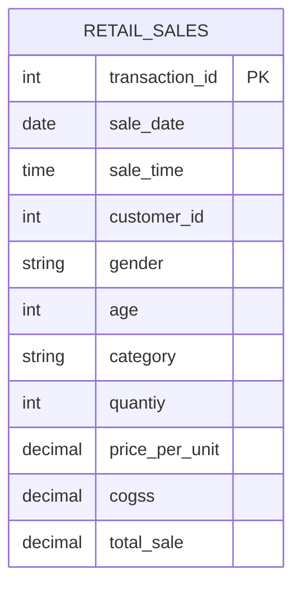

# Retail Sales Performance Analysis using SQL

## Overview
Retail businesses generate thousands of transactions every day, making it difficult to manually identify sales trends, customer behavior, and product performance.

## Business Problem
A retail company wants to better understand its sales performance by answering questions such as:
- Which products generate the highest revenue?
- Which categories contribute the most to sales?
- Who are the most valuable customers?
- How do sales change over time?
The objective is to support data-driven business decisions using SQL.

## Dataset
The dataset contains transactional retail data, including:
- Customers
- Products
- Orders
- Categories
- Quantity
- Unit Price
- Transaction Date

## Database Schema

## Business Questions
1. What are the top-selling products?
2. Which product category generates the highest revenue?
3. Which customers spend the most?
4. What is the monthly sales trend?
5. What is the average order value?

## 🛠 SQL Skills
- SELECT
- WHERE
- GROUP BY
- ORDER BY
- Aggregate Functions
- CASE WHEN
- JOIN
- Subqueries
- CTE
- Window Functions

## Analysis & Results
### Revenue by Category
### Monthly Sales Trend
### Top 10 Products

## Future Improvements
- Build an interactive Power BI dashboard
- Create sales forecasting models
- Perform customer segmentation
